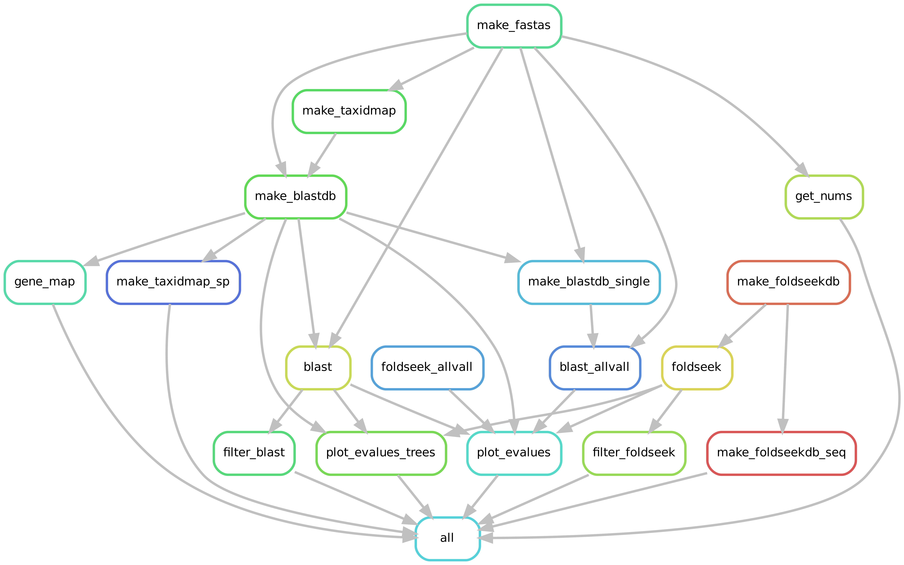
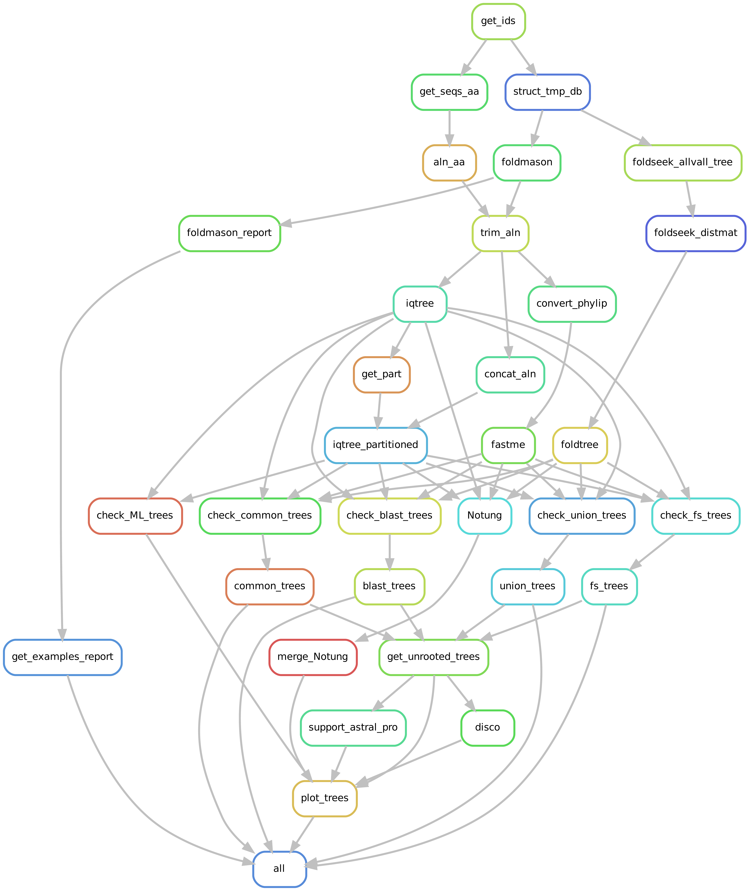

# Structural Phylome: A Tool for Structural Phylogenetic Analysis
[](https://snakemake.github.io)

This repo helps running different phylogenetic analyses, including workflows based on protein structures, given some seed sequences or predefined orthogroups. It may be useful to use and benchmark new structural phylogenetics method. It is designed to be easily expandable, so feel free to contribute with code or ideas for us to include!

The results from the first run of the pipeline are reported in this preprint: [Newly developed structure-based methods do not outperform standard sequence-based methods for large-scale phylogenomics](https://www.biorxiv.org/content/10.1101/2024.08.02.606352v1)

# Installation

Install Snakemake and its dependencies using Conda:

```
conda create -c conda-forge -c bioconda -n snakemake snakemake hdf5 snakefmt snakedeploy
```

Use the --sdm conda flag with Snakemake for dependency management. Alternatively, YAML files for each workflow step are available in workflow/envs/.

The only dependency not automatically managed in the pipeline is gsutil: follow these instructions for [gsutil installation](https://cloud.google.com/storage/docs/gsutil_install). Gsutil is used to download full UniProt proteomes from [AlphafoldDB](https://alphafold.ebi.ac.uk/).

# Data preparation

To run the pipeline the user will need to prepare these files:

1. `metadata`: a file specifying the taxon sampling. All the protein structures and sequences from the species included in the file will be downloaded. **IMPORTANT:** the species must be present in UniProt, you can check [here](https://ftp.uniprot.org/pub/databases/uniprot/current_release/knowledgebase/reference_proteomes/README) if your species are present.
2. `seed_file`: A file with either one column with protein IDs of the seed species or two tab separated columns `orthogroup\tprotein_id`.
3. `species_tree`: The corresponding species tree in newick format
4. `configfile`: A `yaml` file with different parameters

The pipeline can be run in two distinct modes: *Phylome* and *OG*. For the first approach, the user only needs to input a list of protein IDs of the seed species (indicated by `seed: UniProt_id` in the `configfile`). Each protein will be aligned to the structures and sequences of the different taxas indicated in the `metadata` file. Alternatively, if the user already has defined orthogroups the homology search step is skipped and the different trees will be computed on these sets. There are two example `yaml` files for both modes in `config/`.

Importantly, global parameters that are likely to be used across different datasets are in `config/params.yaml`. Note that the values in the first custom yaml are prioritary to the ones in this `params.yaml`! However, it is mandatory that the `configfile` has these fields:

```yaml
# these will be the prefix of the output directory in results/homology
homology_dataset: 'hsap_euka'
# these will be the prefix of the output directory in results/phylogeny
phylo_dataset: 'hsap_1kseeds'
taxids: 'data/input/Hsapopi_set.txt'
species_tree: 'data/sptrees/homo_internal.spTree.nw'
# the seed uniprot id
seed: ['UP000005640']
root: 'Atha'

# this is the number of seed genes to run the pipeline
test_seeds: 'data/seeds/draft_seeds.txt'
```

Once the user has the 4 files, the data downloading can start:

```
snakemake -s workflow/download_data.smk --configfile config/test.yaml -p -j2 --sdm conda
```

This first pipeline is necessary to get all input files. From the input table we can download all the pdbs from google and then consider only those entries with mean average quality > `params["low_confidence"]` value. These proteins will be moved into the `high_cif` folder for each proteome. 

A part from structures, this will also download different metadata for each proteome, including GFFs, CATH IDs and other metadata available in UniProt (in order to link IDs to OMA or EggNOG groups).

You can change the directory where all these data are stored with `params["data_dir"]` parameter but I would just use the default one.

# Usage

## Homology pipeline



First of all, if run in *Phylome* mode, we want to detect homologs with *BlastP* or *Foldseek*. Some of the parameters of the homology search tools can be modified, see the `config/params.yaml`.

```
snakemake --configfile config/example_phylome.yaml -s workflow/run_blast.smk -p -j2 -k --sdm conda
```

Interestingly, given that each UniProt entry is potentially associated to other phylogenomics databases, we can easily benchmark the performance of both tools and parameters. In this case, the general parameters will need to be here: `config/params_ortho_benchmark.yaml`

```
snakemake --configfile config/example_phylome.yaml -s workflow/ortho_benchmark.smk -p -j2 -k --sdm conda
```

## Phylogeny pipeline



Once you downloaded the data and found your homologs you can run the phylogenetic inference for the seeds/OGs specified in the `seed_file`. You can run different combinations of phylogenetic steps that can be specified in the config file:

```yaml
combinations: ["3Di_3Di", "aa_FM", "aa_LG", "3Di_GTR", "3Di_FT", "comb_part", "3Di_LLM", "3Di_AF"] #, "3Di_FTPY"]
modes: ['blast', 'fs', 'common', 'union']
```

The main thing is that for each seed gene there will be # modes * # combinations tree files (assuming 4 modes and 8 combinations=32 trees per seed). Therefore, this can expand quickly and you may want to explore only some specific combination of tools. The output files will be named with this pattern: `{seed}_{target_set}_{alphabet}_{model}`. The different `models` are explained in details in the [preprint](https://www.biorxiv.org/content/10.1101/2024.08.02.606352v1). 

* **Alignment**: 
	* **aa**: mafft --auto + trimal -gappyout
	* **3Di**: Foldmason + trimal -gappyout
	* **comb**: concatenate **aa** and **3Di**

* **Tree inference**:
	* **LG**: iqtree2 -s **aa.fa** --prefix $tree_prefix -B 1000 -T {threads} --boot-trees --quiet --mem 4G --cmin 4 --cmax 10 –mset LG
	* **FM**: fastme -q -p -T {threads} -b {params} -i **aa.phy** -o {output} > {log}
	* **3Di**: iqtree2 -s **3Di.fa** {same as LG} –mset 3DI -mdef resources/subst_matrixes/3DI.nexus
	* **GTR**: iqtree2 -s **3Di.fa** {same as LG} –mset GTR20
	* **AF**: iqtree2 -s **3Di.fa** {same as LG} –mset resources/subst_matrixes/Q_mat_AF_Garg.txt
	* **LLM**: iqtree2 -s **3Di.fa** {same as LG} –mset resources/subst_matrixes/Q_mat_LLM_Garg.txt
	* **Part**: Create partition file with best model from **LG** and **3Di**. Then
		iqtree2 -s **comb.fa** -p {input.part} --prefix $tree_prefix -mdef resources/subst_matrixes/3DI.nexus -B 1000 -T {threads}
	* **FT**: foldseek easy-search $structdir $structdir {output} $TMPDIR --format-output 'query,target,fident,lddt,alntmscore' --exhaustive-search -e inf; foldseekres2distmat_simple.py; quicktree

Since the drafting of the preprint two new models have been added **AF** and **LLM** from [Garg & Hochberg, 2024](https://www.biorxiv.org/content/10.1101/2024.09.19.613819v3). They work exactly as **3Di** but with new substiution matrixes (available in `resources/subst_matrixes/`).

To finally run the pipeline you can simply run this command and monitor that everything is more or less running fine.

```
snakemake --configfile config/example_phylome.yaml -p -j2 -k --sdm conda
```

The most important output files will be these two: 

* `results/{dataset}/trees/{seed}_unrooted_trees.txt`: has 5 columns (gene ID, target set, alphabet, model and tree text). This file is easily parsable in R or Python to do further analyses. You can find some R scripts to do that in `workflow/scripts/` 
* `results/{dataset}/trees/{seed}_mltrees.txt`: results of IQ-Tree model selection. 

# Contribute

This modular pipeline was born with the idea to be easily expandable as so many new structural phylogenetics tools are being released each month. Feel free to contribute or open an issue!